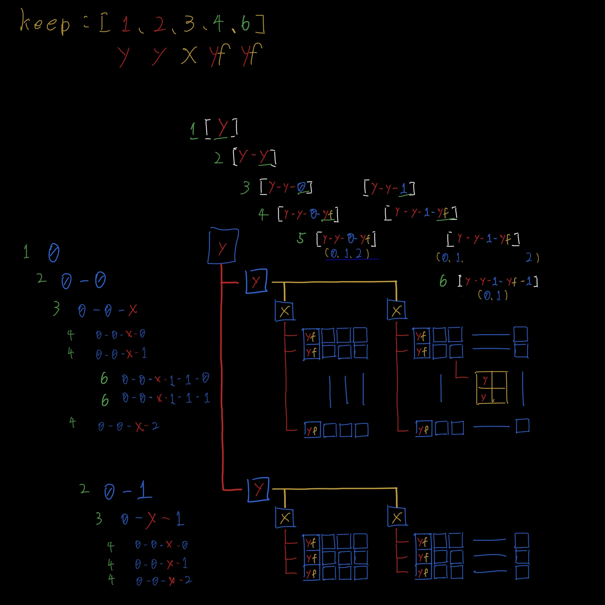
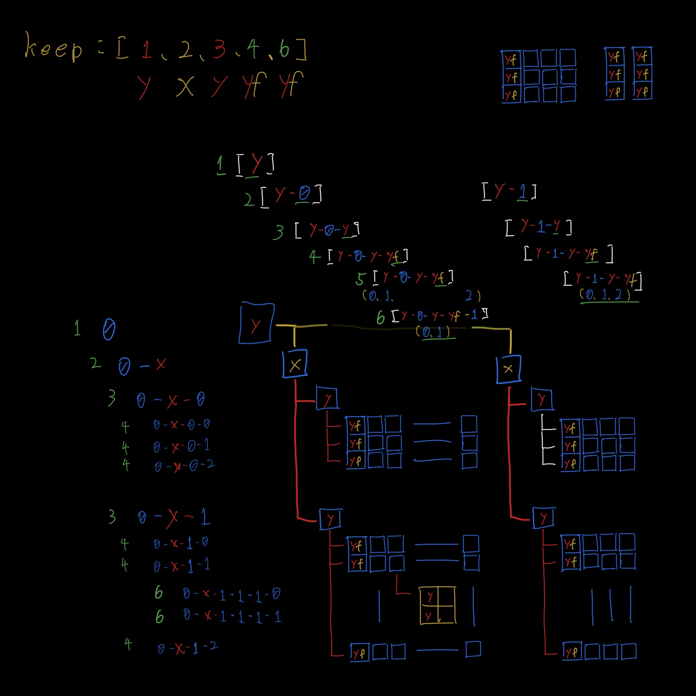

# SetPrint 実装項目メモ

| バージョン | シーケンス型 | マッピング型 | 数列での整形 | 表示スタイル<br>カスタマイズ | 処理の効率化<br>[ × < △ < ⚪︎] | pick_guideprint |
|:--------:|:----------:|:----------:|:-------:|:------------------------:|:----------:|:-:|
|   0.0.0  |     ⚪     |     ×     　|    ×    |       ×                 |      ×     |⚪︎|
|   0.1.0  |     ⚪     |     ×     　|    ×    |       ×                 |      △     |⚪︎|
|   0.2.0  |     ⚪     |     ×     　|    ×    |      ⚪                 |      △     |⚪︎|
|   デモ    |     ⚪     |     ⚪︎      |    ×    |      ⚪︎                 |      △ 　　|⚪︎|
|0.3.0(予定)|     ⚪     |     ⚪      |    ⚪︎    |      ⚪                 |      △ 　　|⚪︎|

---
<br>

---
- # {開発中...} ver 0.3.0 実装項目
  
    ## 辞書型実装による既存の機能の廃止と新規機能

    ---
    > ## 廃止 ___ ボックス表示

    - ### 辞書型_整形イメージ
        格納例_python
        ```python
        # データの作成
        test_data = (
            [0.0, 0.1, 0.2],
            {zero: 0, one: 1, two: 2},
            {zero: 0, frst: {zero: 0, one: 1}, second:2}
        )

        # インスタンスを生成
        list_data = SetPrint(test_data)

        # データの整形
        set_datas = list_data.set_list(guide=True,keep_start=1,keep_range='all')

        # 表示
        for line in set_datas:
            print(line[-1])
        ```
        整形結果_txtfile
        ```
        =========================================================================
         {} | {n}                                                               |
            |-------------------------------------------------------------------|
            :                                                                   :
            |  ►list [ ****  0.0 ****  0.2   ` -------  ------ ` ******  0.2 ]  |
            |  ◆dict { zero: 0    one: 1     ` -------  ------ `    two: 2   }  |
            |  ◆dict { zero: 0   frst: ◆dict / zero: 0, one: 1 / second: 2   }  |

        =========================================================================
        ```

    <br><br>
    
    ---
    > ## 新規機能 /// PlaneView(平面ビュー)

    >> デモ版 : ver 0.3.0 [ PlaneView 搭載版 ]<br>https://github.com/mtur2007/SetPrint/blob/main/Development_files/update_0_3_d/demo_setprint_0_3_0.py

    <改良>
    - [完成] ボックス表示の廃止/ルート表示機能 ... ルート(経路)を線で描画し、関係をより視覚的に表す。


    <新規>
    - [不完全] PlaneView (平面ビュー) ... 同時に複数の次元を多方向へ展開出来るようにする機能。

        #### PlaneView (平面ビュー)
        
        フラット化する方向の拡張<br>
        Y方向へ表示させ、X方向への過剰な整形を解消し、<br>
        辞書型などの見出し的な項目を見やすくする。


        <br>

        ---

        ### 実装イメージ

        | 横方向 | 縦方向 |
        |---|---|
        |  |  |


    <br><br>
    
    ---
    > ## 存続機能 [[[ 表示スタイルカスタマイズ
    - ### 表示スタイルの変更
        #### set_listで表現される特殊な要素をまとめた表<br>
        (記号の部分はデフォルトです)
        
        | スタイル名      | 用途      | タイプ     　| 記号/数値<br>(変更可能) | 説明　            | 指定制限             |
        |:-------------:|:----------|:-----------|:-------------|--------------------------|---------------------|
        | "Collections" | image     | list       | '►list'      | 配列の格納を表す            | type: str           |
        |    ``         | ``        | tuple      | '▷tuple'     | ``                       | type: str,          |
        |    ``         | ``        | ndarray    | '>ndarray'   | ``                       | type: str,          |
        |    ``         | ``        | dict　　　  | '◆dict'      | ``                       | type: str,          |
        | ------------- | --------  | ---------  | ----------   | ------------------------ | ------------------- |
        | "bracket"     | partially | list       | '{' ・ ")"   | 他の配列と違う次元要素       | type: str, len: 0<l |
        |    ``         | ``        | tuple      | '<' ・ ">'   | ``                       | type: str, len: 0<l |
        |    ``         | ``        | ndarray    | '(' ・ "}'   | ``                       | type: str, len: 0<l |
        |    ``         | ``        | dict       | '/' ・ "/'   | ``                       | type: str, len: 0<l |
        |    ``         | ``        | None       | '`' ・ "``"  | 存在しない次元要素　　       | type: str, len: l=1 |
        | ------------- | --------  | ---------  | ----------   | ------------------------ | ------------------- |
        | "padding"     | style     |            | ' '          | 字数の穴埋め               | type: str, len: l=1 |
        | ------------- | --------  | ---------  | ----------   | ------------------------ | ------------------- |
        | "empty"       | style     | value      | '-'          | 存在しない要素　　          | type: str, len: l=1 |
        |    ``         | ``        | key        | '*'          | 存在しない辞書要素(key)　   | type: str, len: l=1 |
        | ------------- | --------  | ---------  | ----------   | ------------------------ | ------------------- |
        | "settings"    | print     |            | True         | スタイル設定値の表示,非表示　 | type: bool          |
        | "progress"    | print     |            | True         | プログレスバーの表示,非表示　 | type: bool          |
        | ``            | len       |            | int: 20      | プログレスバーの長さ　     　| type: int, num: 0<n |
        
        **`set_text_style`**

        スタイル変更として'記号'の部分を変更することができます。
        - **実行例**
            ```python
            #list_data = SetPrint(list)
                
            arguments = (

            (("Collections" ,
                {  'image'   : { 'list'    : '►list' ,
                                 'tuple'   : '▷tuple' ,
                                 'ndarray' : '>nadarray' ,
                                 'dict'    : '◆dect' }}),

             ("bracket"     ,
                { 'partially': { 'list'    : ( '{' , ')' ),
                                 'tuple'   : ( '<' , '>' ),
                                 'ndarray' : ( '(' , '}' ),
                                 'dict'    : ( '{' , ')' ),
                                 'None'    : ( '`' , '`' )}}),

             ("padding"     , {  'key'   : (' ', ':') , 'value'  : ' ' }),
             ("empty"       , {  'key'   : ('*', ' ') , 'value'  : '-' }),


             ("settings"    , { 'print'  : True }),
             ("progress"    , { 'print'  : False  ,
                                'len'    : 20  }))
            )
            
            list_data.set_text_style(arguments) # set_listの前

            # インデックスで引数のチェックを行う為、この配列の通りに指定してください。
            # 制限の範囲内ではなかった値は表示され、デフォルトの値が代入されます。
            
            # set_datas = list_data.set_list(guide=True, keep_start=1, keep_range='all')
            ```
